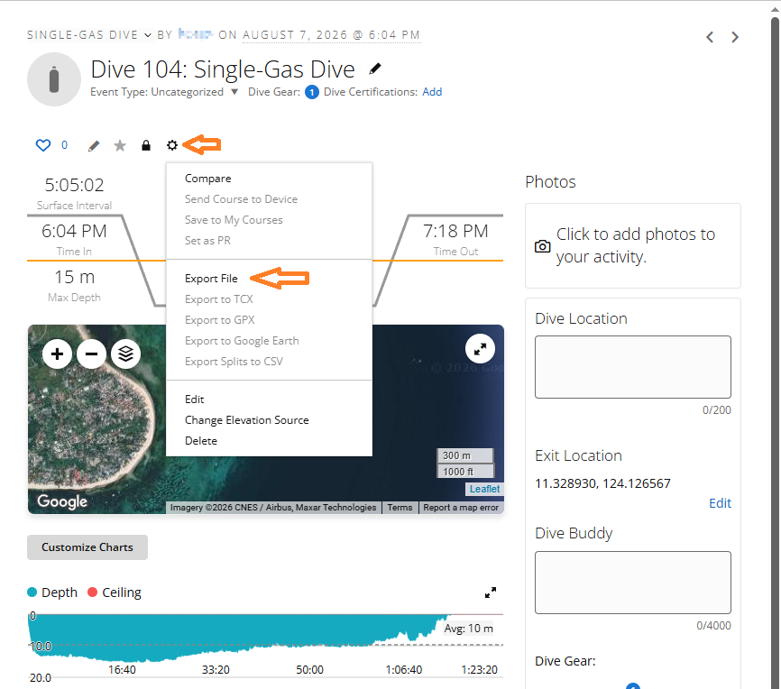
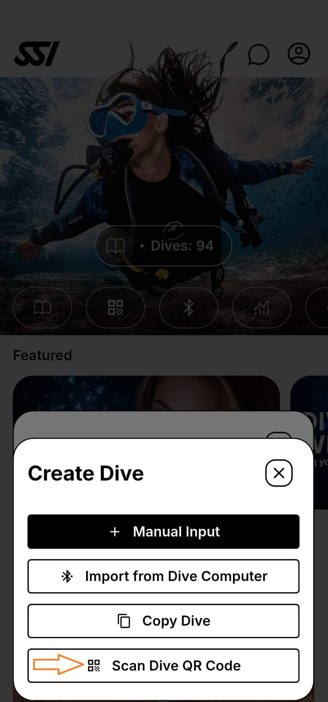

# Convert to SSI

Import dive logs from supported devices (e.g. Garmin `.fit`) and generate a QR code for import into the SSI app.

## Table of contents

- [How it works](#how-it-works)
  - [Export from Garmin Connect](#export-from-garmin-connect)
  - [Import into the SSI app](#import-into-the-ssi-app)
- [Stack](#stack)
- [Structure](#structure)
- [Run locally](#run-locally)
- [Tests](#tests)
- [Deploy (Vercel)](#deploy-vercel)
- [Supported sources](#supported-sources)
- [Privacy](#privacy)
- [License](#license)
- [Legal](#legal)

## How it works

1. **Export** a dive from Garmin Connect as a `.fit` (or `.zip`) file.
2. **Upload** it here to generate an SSI-ready QR code.
3. **Scan** the QR code in the SSI app to prefill a new dive log.

### Export from Garmin Connect



### Import into the SSI app



## Stack

- **Frontend & API:** Next.js 14 (App Router), TypeScript, Tailwind CSS
- **i18n:** next-intl (English, Traditional Chinese)
- **FIT parsing:** [@garmin/fitsdk](https://www.npmjs.com/package/@garmin/fitsdk)
- **Deploy:** Vercel (serverless)

## Structure

```
convert-to-ssi/
├── app/
│   ├── [locale]/
│   │   ├── layout.tsx
│   │   └── page.tsx           # Upload UI + QR display
│   ├── api/
│   │   └── upload/
│   │       └── route.ts       # POST: accept .fit/.zip, return QR / SSI data
│   ├── globals.css
│   ├── layout.tsx
│   └── providers.tsx
├── components/
│   ├── garmin-export-guide-dialog.tsx
│   └── ssi-import-guide-dialog.tsx
├── lib/
│   ├── fit-to-ssi.ts          # FIT decode → SSI mapping → QR payload
│   └── upload-limits.ts       # Upload size limit (10 MB)
├── messages/
│   ├── en.json
│   └── zh.json
├── i18n/
│   └── request.ts
├── middleware.ts
├── next.config.mjs
├── package.json
└── tsconfig.json
```

## Run locally

```bash
npm install
npm run dev
```

Open [http://localhost:3000](http://localhost:3000).

## Tests

```bash
npm test
```

GitHub Actions also runs `npm test` and `npm run build` on pushes and pull requests to `master`.

## Deploy (Vercel)

```bash
vercel
```

Or connect the repo in the Vercel dashboard.

## Supported sources

- **Garmin:** `.fit` files and `.zip` archives containing a single `.fit` file (via Garmin FIT SDK).

## Privacy

Uploaded files are processed in memory on the server and are not stored.

## License

This project is licensed under the [MIT License](LICENSE).

## Legal

**Unofficial tool.** This project is not affiliated with, endorsed by, or sponsored by Garmin International, Inc. or Scuba Schools International (SSI). Garmin and SSI are trademarks of their respective owners.

**Third-party software.** FIT file parsing uses the Garmin FIT JavaScript SDK ([`@garmin/fitsdk`](https://www.npmjs.com/package/@garmin/fitsdk)), which is proprietary software licensed by Garmin International, Inc. See the [FIT Protocol License Agreement](https://github.com/garmin/fit-javascript-sdk/blob/main/LICENSE.txt) included with that package.
